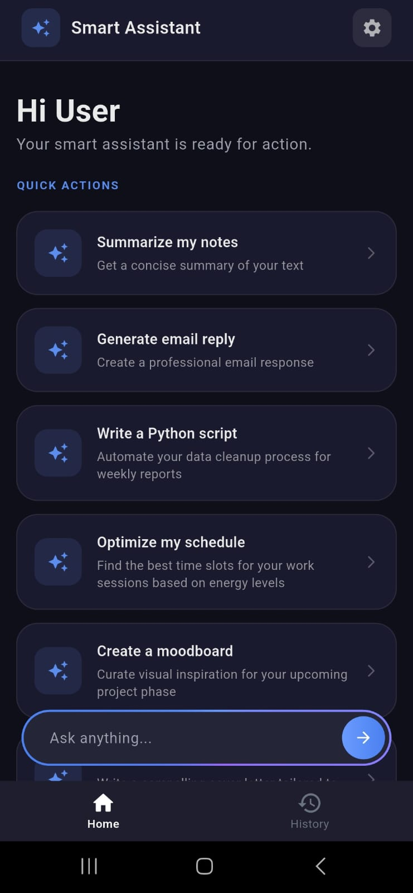
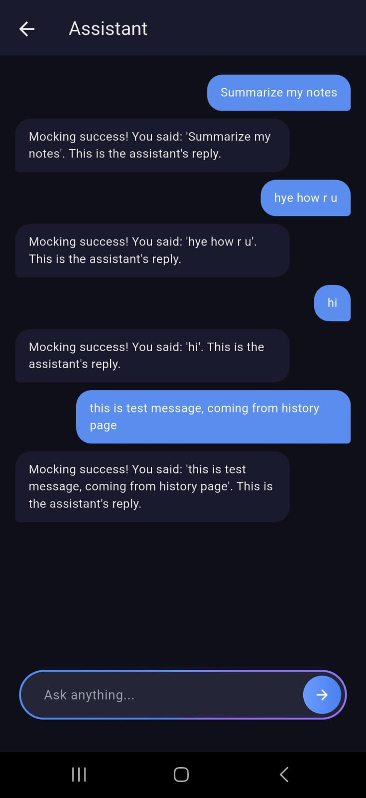
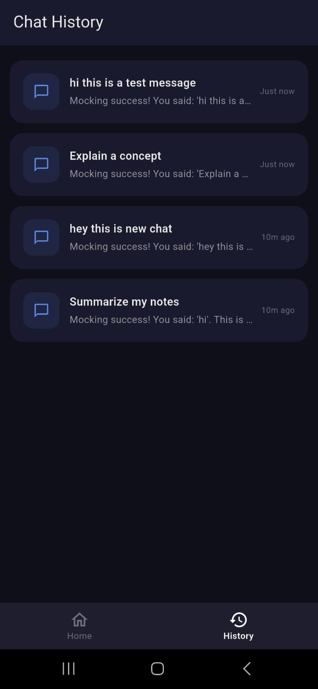
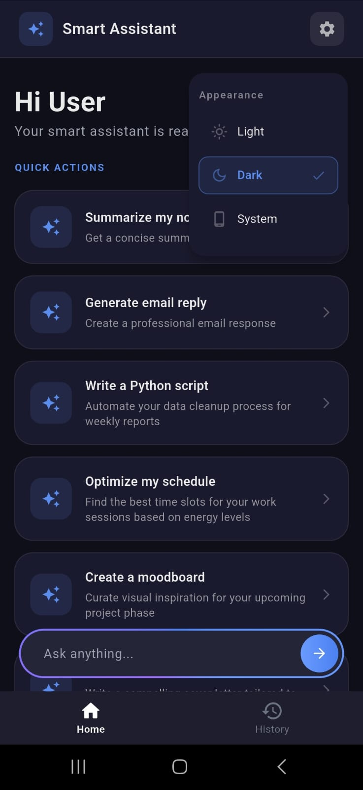
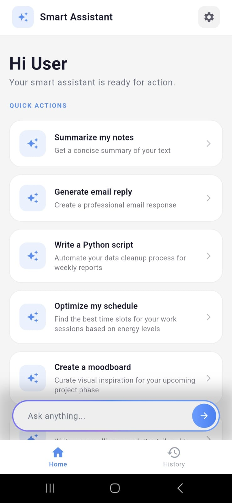
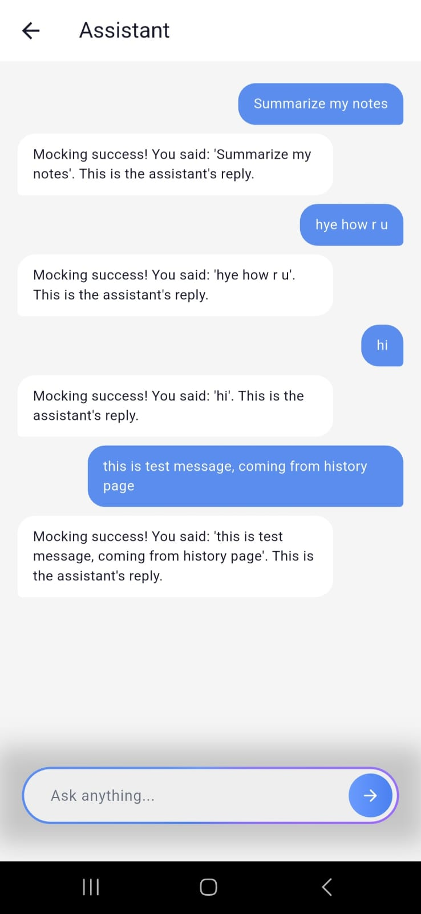
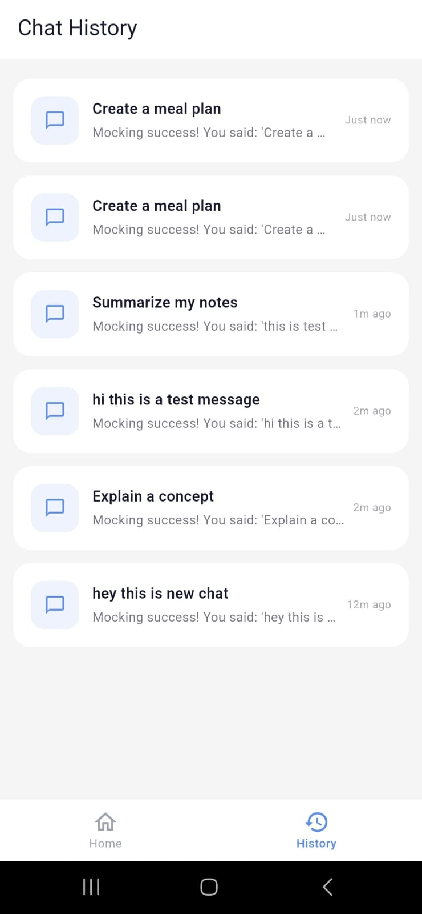
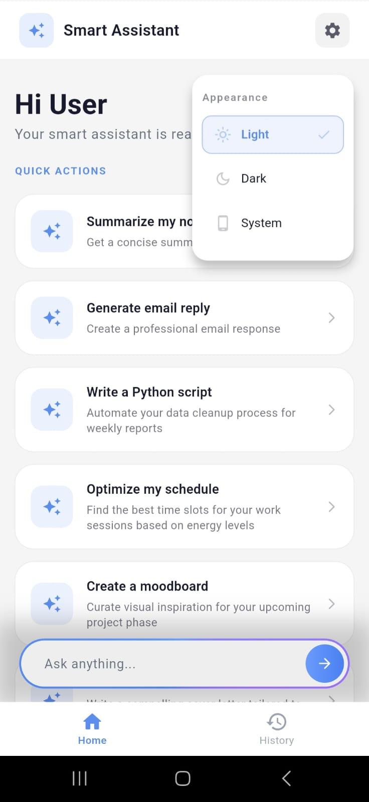
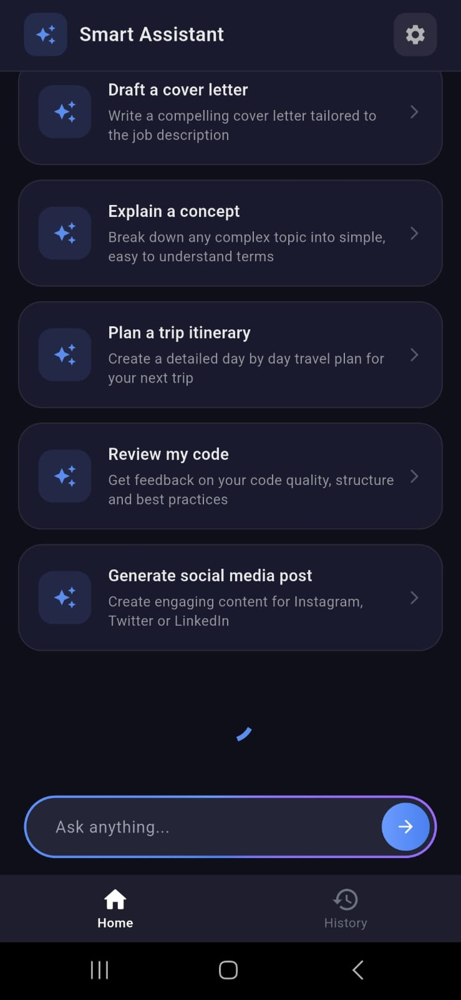
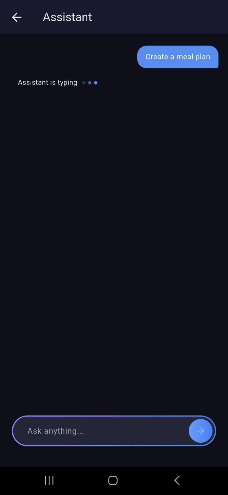

# 🤖 Smart Assistant App

A Flutter-based Smart Assistant app built as part of a developer assignment. The app simulates a real-world AI assistant experience with suggestions, chat, and history features.

---

## 👤 Author
**Sumanth Ganeshan**
```Email - sumanthganeshan@gmail.com```

---

## 📱 Screenshots

### 🌑 Dark Theme
| Home | Chat | History | Theme Toggle |
|------|------|---------|--------------|
|  |  |  |  |

### ☀️ Light Theme

| Home | Chat | History | Theme Toggle |
|------|------|---------|--------------|
|  |  |  |  |

### Pagination and Chat Animation

| Suggestion Scroll Pagination | Chat Animation |
|------|------|
|  |  |
---

## ✨ Features

- 📋 **Suggestions** — Paginated list of quick action suggestions
- 💬 **Chat** — Real-time chat UI with typing indicator and assistant replies
- 🕓 **History** — Persistent offline chat history
- 🌗 **Theming** — Light, Dark and System theme support with persistence

---

## 🏗️ Architecture

This app follows **Clean Architecture** with a **feature-first** folder structure.
```
lib/
├── core/
│   ├── di/                         
│   ├── router/                     
│   ├── theme/                     
│   └── presentation/
│       └── widgets/                
│
├── features/
│   ├── suggestions/
│   │   ├── data/
│   │   │   ├── datasources/        
│   │   │   ├── models/             
│   │   │   └── repositories/      
│   │   ├── domain/
│   │   │   ├── entities/           
│   │   │   ├── repositories/      
│   │   │   └── usecases/          
│   │   └── presentation/
│   │       ├── bloc/               
│   │       ├── pages/              
│   │       └── widgets/           
│   │
│   └── chat/
│       ├── data/
│       │   ├── datasources/       
│       │   ├── models/             
│       │   └── repositories/      
│       ├── domain/
│       │   ├── entities/           
│       │   ├── repositories/      
│       │   └── usecases/          
│       └── presentation/
│           ├── bloc/
│           │   ├── chat/          
│           │   └── history/        
│           ├── pages/             
│           └── widgets/            
│
└── main.dart
```

---

## 🧠 State Management

**BLoC (flutter_bloc)** is used throughout the app.

| BLoC | Responsibility |
|------|---------------|
| `SuggestionsBloc` | Fetches paginated suggestions, manages pagination state |
| `ChatBloc` | Handles sending messages, loading conversations, typing state |
| `HistoryBloc` | Fetches and displays conversation history |

Theme state is managed with **ValueNotifier** — a deliberate choice since theme toggling is simple UI state with no business logic.

---
## Dependency Injection
**Dependency Injection** is handled by **GetIt** (service locator pattern). All BLoCs, UseCases, Repositories and DataSources are registered in `core/di/injection_container.dart`.

## 🗄️ Local Storage

**Hive** is used for offline chat history persistence.

- `MessageHiveModel` — stores individual messages
- `ConversationHiveModel` — stores full conversations
- Theme preference is also persisted via Hive

---

## 🔌 API

Since no base URL was provided, all APIs are **mocked locally**:

- **Suggestions** — loaded from a local JSON asset file with pagination logic
- **Chat** — mock remote datasource with simulated delay (`Future.delayed`)
- **Chat History** — served from Hive local storage

---

## 🚀 Setup & Installation

### Prerequisites
- Flutter `3.41.4`
- Dart `3.11.1`
- Android Studio / VS Code

### Steps

**1. Clone the repository**
```bash
git clone https://github.com/sumanthganeshan/smart-assistant-app.git
cd smart-assistant-app
```

**2. Install dependencies**
```bash
flutter pub get
```

**3. Run the app**
```bash
flutter run
```

**4. Build release APK**
```bash
flutter build apk --release
```

---

## 📦 Packages Used

| Package |
|---------|
| `flutter_bloc` | 
| `get_it` |
| `hive` |
| `hive_flutter` | 
| `hive_generator` |
| `build_runner` | 

---

## ✅ Assignment Checklist

| Requirement | Status |
|-------------|--------|
| Suggestions list with pagination | ✅ |
| Chat UI with loading indicator | ✅ |
| Chat history screen | ✅ |
| Clean folder structure | ✅ |
| BLoC state management | ✅ |
| Navigation & routing | ✅ |
| ThemeData with light/dark mode | ✅ |
| Offline chat history (Hive) | ✅ |
| Dark mode support | ✅ |
| Typing animation | ✅ |
| Unit tests | ❌ |


